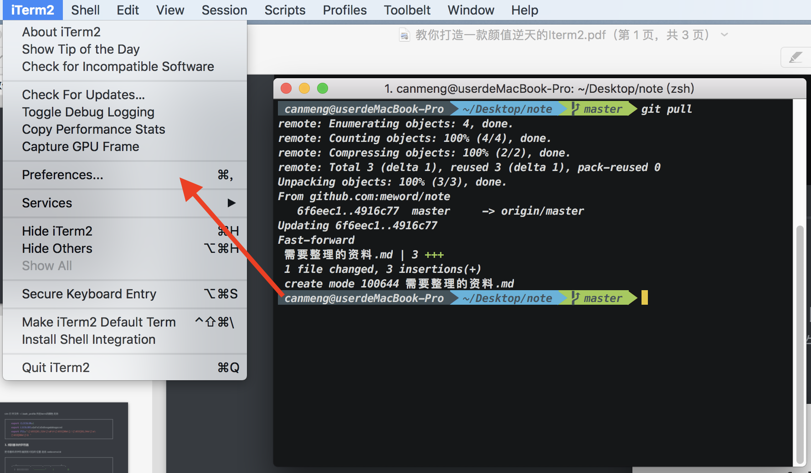
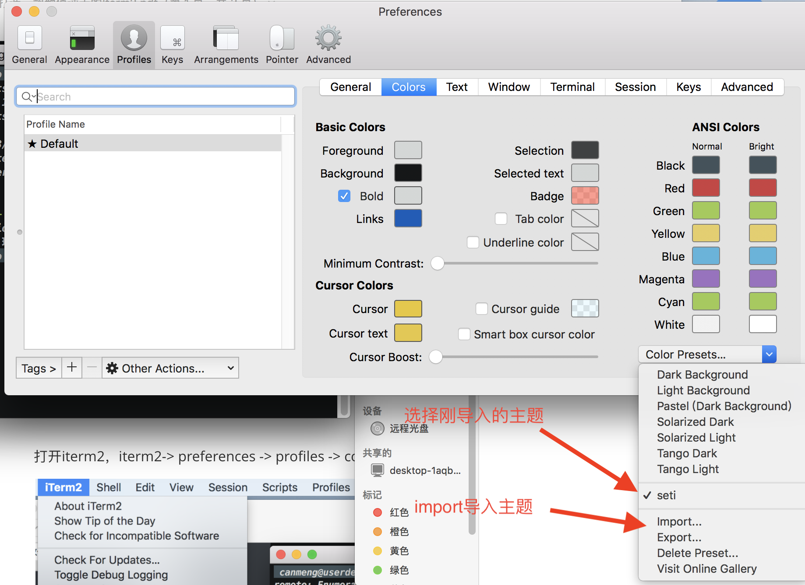
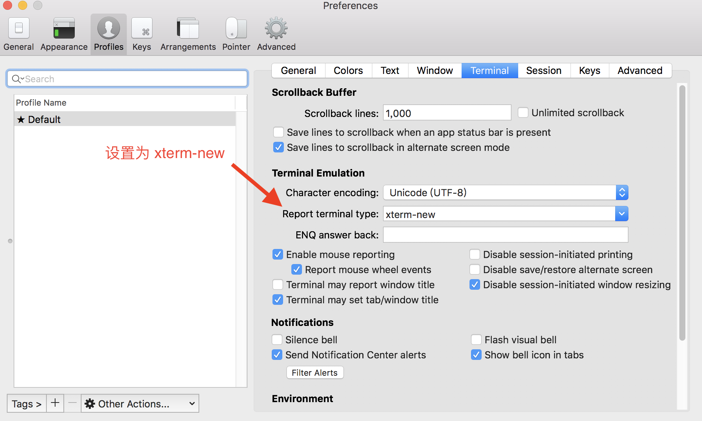
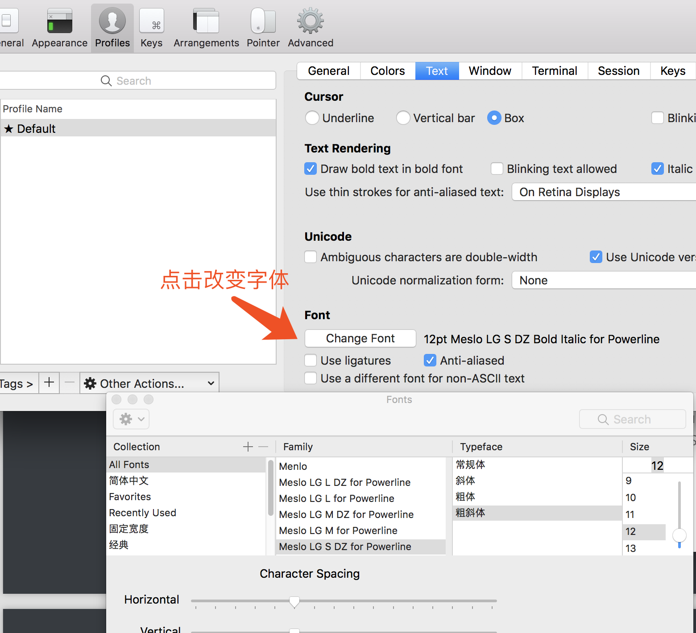
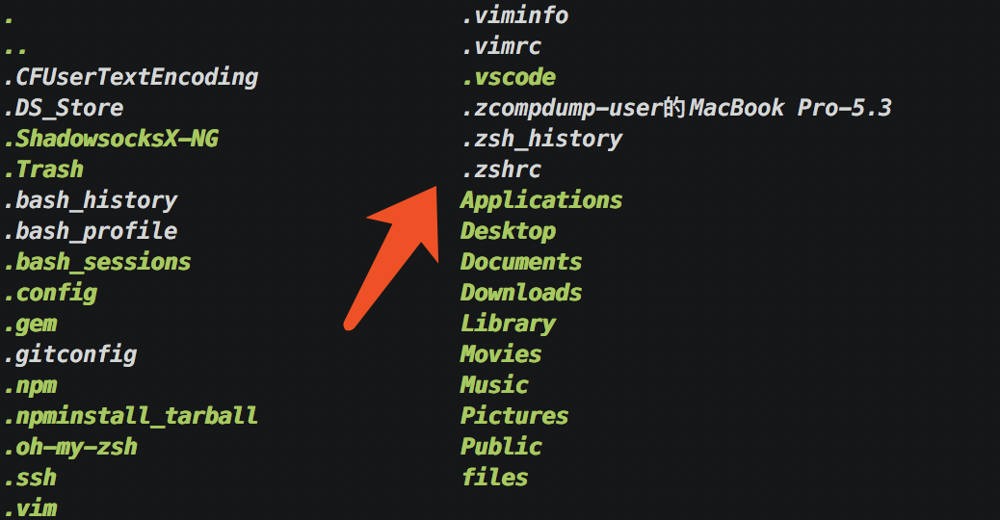
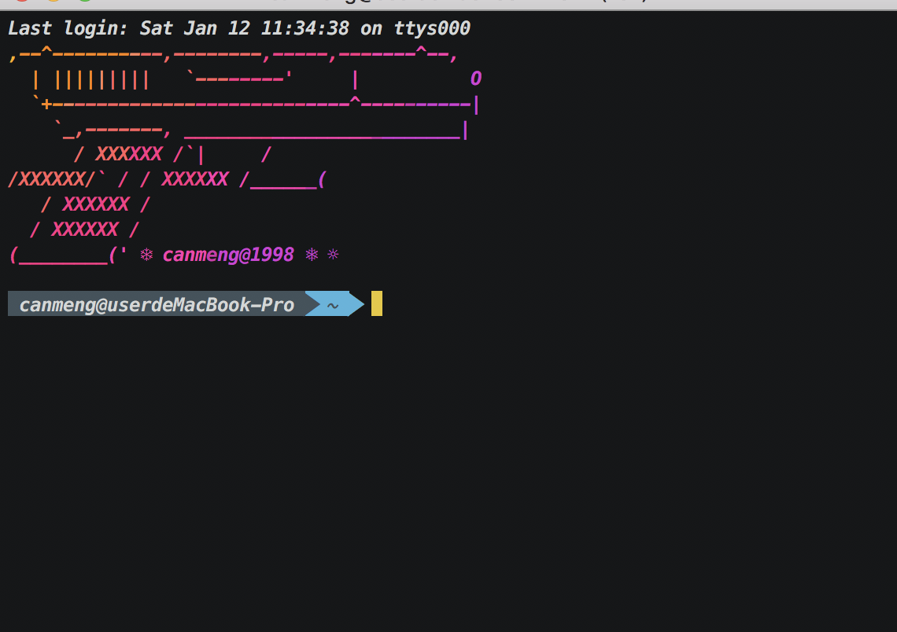

### 1. 安装主题

下载[seti_ui](https://github.com/willmanduffy/seti-iterm)，放到指定位置（比如桌面）


> 打开iterm2，iterm2-> preferences -> profiles -> colors->colors presets-> import 






### 2. 让命令行变色

vim 打开⽂件 ~/.bash_profile 开启term的颜⾊支持

```bash
# enables colorin the terminal bash shell export
export CLICOLOR=1
# sets up thecolor scheme for list export
export LSCOLORS=gxfxcxdxbxegedabagacad
# sets up theprompt color (currently a green similar to linux terminal)
export PS1='\[\033[01;32m\]\u@\h\[\033[00m\]:\[\033[01;36m\]\w\[\033[00m\]\$ '
# enables colorfor iTerm
export TERM=xterm-color

alias grep='grep --color'
alias egrep='egrep --color'
alias fgrep='fgrep --color'
```


> wq保存退出，使其生效

```bash
source ~/.bash_profile
```


> 设置`iTerm2`使其生效

```bash
preference->profiles->Default->Terminal->xterm-new  设置终端类型
```




### 3. 找到喜欢的字符画

> 找到你喜欢的字符画，把字符画放到对应的位置（比如桌面），起名 webcome.txt

```tex
,--^----------,--------,-----,-------^--,
  | |||||||||   `--------'     |          O
  `+---------------------------^----------|
    `_,-------, _________________________|
      / XXXXXX /`|     /
/XXXXXX/` / / XXXXXX /______(
   / XXXXXX /
  / XXXXXX /
(________( ❄ 字符画 ❅ ☼ `------'
```


### 4. 让字符变得漂亮起来

> 安装https://github.com/busyloop/lolcat（在终端使用 gem install lolcat 安装）


### 5. 下载安装字体库

>https://github.com/powerline/fonts 安装完字体库之后，把iTerm 2的设置⾥里里的Profile中的Text 选项卡
>中⾥里里的Regular Font和Non-ASCII Font的字体都设置成 Powerline的字体，我这⾥里里设置的字体是12pt Meslo LG S DZ Regular for Powerline




### 6. 安装oh-my-zsh

> curl -L https://raw.github.com/robbyrussell/oh-my-zsh/master/tools/install.sh | sh


安装完成时我们当前用户下会有一个`.zshrc`文件（.开头的都是隐藏文件，必须用`ls -a`才能查看得到）




### 7. 编辑文件.zshrc

> 在.zshrc头部增加配置

```bash
# 字符画文件的位置
lolcat ~/Desktop/webcome.txt
export CLICOLOR=1
export LSCOLORS=GxFxCxDxBxegedabagaced
export PS1='\[\033[01;32m\]\u@\h\[\033[00m\]:\[\033[01;34m\]\w\
[\033[00m\]\$ '
```

> wq保存退出并使其生效

```bash
source ~/.zshrc
```


到了这一步，我们关闭iterm2，重新运行就会发现界面是这样的




### 8. 修改vi文本编辑器的颜色

> mac下, 自带vim编辑器, 当我们使用vi时, 实际被软连接到vim, 所以我们希望vim也能使用上述配色需要进行设置

```bash
vi ~/.vimrc
```

> 添加内容

```bash
# 开启语法高亮显示
syntax on
# 显示行号 (可选)
set nu
# 允许光标移动
set mouse=a
```

> wq 保存退出, 此时vi文本编辑器即可高亮显示


### 最后更换主题

> 下载agnoster主题 到下载的⼯程里⾯运行install文件,主题将安装到~/.oh-my-zsh/themes⽬录下 

> 设置主题：进⼊~/.zshrc打开.zshrc⽂文件，然后将ZSH_THEME后⾯面的字段改为agnoster。 ZSH_THEME="agnoster"(agnoster即为要设置的主题) 


配置到这里，我们就算大功告成啦！