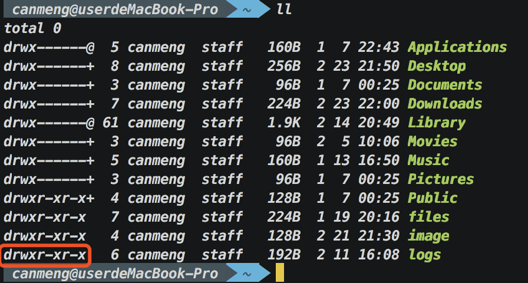

#### 文件权限查看

当我们在命令行输入`ll`或`ls -l`的时候，能看到列表第一项是一群字母



**drwxr-xr-x**

第一个字母`d`，代表的是这个文件的类型


**rwx  r-x  r-x**

剩下的这九个字母分为了三组，每三个为一组，每一组都代表一组权限

第一组：代表文件的所有者的操作权限

第二组：和文件所有者同一用户组下的其他用户拥有的操作权限

第三组：代表其他用户（除了文件所有者和文件所有者同一用户组下的其他用户之外的用户）的操作权限


`r` (read)：代表可读

`w` (write)：代表可写，可被修改，可以删除

`x`：代表可被执行

`-`：代表对应的权限不存在，也就是没有对应的权限


---

#### 查看对应程序帮助

可以使用`xxx --help`获取帮助

或者使用`man xxx`获取详细帮助


---

#### 文件传输上服务器


**ftp 命令**

现在很少有人用，因为ftp本身不是很安全，用起来比较复杂


**scp 命令** 

远程复制文件，使用的是加密连接，也就是加密的远程复制

使用：`scp 复制的文件 要复制到的地方`

例：

> 复制单个文件

```bash
scp ./test.zip root@192.168.0.21:/root/test
		|							|
	 复制的文件				 要复制到的目录(绝对路径)
```

> 复制多个文件

```bash
scp ./*.zip root@192.168.0.21:/root/test
		|							|
	 复制的文件				 要复制到的目录(绝对路径)
```


**samba程序**

作用：将目录共享到局域网，实现传输（window下局域网使用）


在服务器上下载`samba`：

在 CentOS 里用：`yum` 安装

在 Ubuntu 里用：`apt-get` 安装

```bash
yun install samba
```


修改`samba`配置文件：

> 找到`samba`配置文件

```bash
cd /etc/samba/
```

>  打开`smb.conf`文件

```bash
vim smb.conf
```

> 找到[homes]并修改

```bash
[homes]
	path = /publicPath	# 配置开放的地址
	creat mask = 0644	# 权限掩码，配置操作权限 
```

> 启动 samba

CentOS 7 或 7 以后

```bash
systemctl start smb
```

CentOS 7 之前 和 Ubuntu

```bash
service smb start
```


---

#### 配置服务器免密登录


**知识点**

免密登录使用的是证书验证机制

证书分为两个部分：公钥和私钥（合起来叫做：密钥对），使用的是不对称加密（加密方法和解密方法完全是两种方式），公钥用在服务器上，私钥则用在自己的电脑上


**生成密钥对**

``` bash
ssh-keygen -t rsa -C "canmeng" -f "key_rsa"
		    |      |			|
			|      |			|
			|      |	 指定密钥生成的文件名
			|      |
			|   	将一个名字嵌入密钥中X（好分辨密钥）
			|
指定生成密钥的加密方式（这里使用 rsa加密方式 默认长度128位）
```

接下来会出现一些问题（默认情况下直接回车就好）

``` bash
Enter passphrase (empty for no passphrase):（问你要不要给这个密钥添加密码，需要就填）

Enter same passphrase again（再次输入相同密码）
```

然后就会生成出密钥对了，私钥是`key_rsa`，公钥是`key_rsa.pub`


**配置密钥**

首先在客户端将公钥放置服务器上

``` bash
scp ./key_rsa.pub root@(服务器ip / 域名):/root/.ssh
```

将私钥移动到当前用户的`.ssh`文件夹下（这一步并不是必须的，只是为了方便管理私钥）

``` bash
mv ./key_rsa ~/.ssh/
```

到服务器将公钥导入到系统配置文件当中

``` bash
cat key_rsa.pub > authorized_keys
```

到客户端，配置 ssh 的配置文件

``` bash
cd ~/.ssh/
```

在 .ssh 文件夹下，有个 config 文件（也可能没有，没有的话就自己新建一个）

``` bash
# Host: 给服务器取的别名(配置完可以通过 ssh 别名进行登录)
# User: 登录的用户
# HostName: 服务器ip地址或者域名
# IdentityFile: 私钥文件路径
# Protocol: 协议版本号

# 多主机配置
Host gateway-produce
HostName IP或绑定的域名
Port 22
Host node-produce
HostName IP或绑定的域名
Port 22

# Host 匹配上面的配置
Host *-produce
User root
IdentityFile ~/.ssh/rsa
Protocol 2
Compression yes
ServerAliveInterval 60
ServerAliveCountMax 20
LogLevel INFO


#单主机配置
Host cm
User root
HostName IP
IdentityFile ~/.ssh/rsa
Protocol 2
Compression yes
ServerAliveInterval 60
ServerAliveCountMax 20
LogLevel INFO
```

按照自己需要的开发需要进行配置

之后就可以用 ssh + 别名进行免密登录了

``` bash
ssh cm
```


**手动指定私钥**

``` bash
ssh -i 私钥文件路径+文件名(最好绝对路径) root@ip
```

