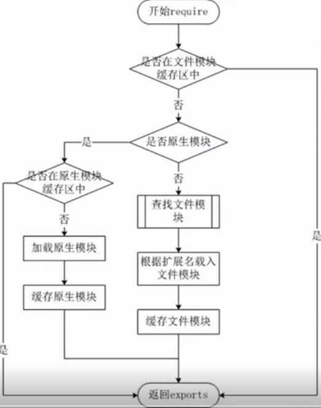

#### 模块化的概念与意义

+ 为了让 Node.js 的文件可以相互调用，Node.js 提供了一个简单的模块系统
+ 模块是 Node.js 应用程序的基本组成部分
+ 文件和模块是一一对应的。一个 Node.js 文件就是一个模块
+ 这个文件可能是 JavaScript 代码、JSON 或者编译过的 C/C++ 扩展
+ Node.js 中存在 4 类模块 （原生模块和 3 种文件模块）


#### Node.js 的模块加载流程




#### Node.js 的模块加载方式

+ 从文件模块缓存中加载
+ 从原生模块加载
+ 从文件加载


#### require 方法加载模块

require 方法接受一下几种参数的传递：

+ http、fs、path 等原生模块
+ ./mod 或 ../mod
+ ，相对路径的文件模块
+ /pathtomodule/mod，绝对路径的文件模块
+ mod，非原生模块的文件模块


例：

> hello.js

``` javascript
function Hello(name) {
	this.name = name;
}

Hello.prototype.setName = function(argName) {
	this.name = argName;
}

Hello.prototype.sayName = function() {
	console.log(`Hello ${this.name}`);
}

// 导出模块
module.exports = Hello;
```


> index.js

``` javascript
// 引入模块
const Hello = require('./hello.js');

const hello = new Hello();

hello.setName('张三');

hello.sayName();
```

