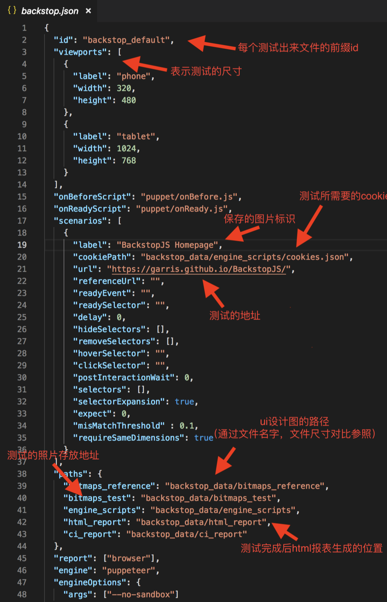

### 利用backstop进行ui测试

[参考地址](https://www.npmjs.com/package/backstopjs)

首先我们全局安装`backstop`

```bash
npm install -g backstopjs
```


初始化backstop

```bash
backstop init
```


初始化后得到`backstop_data`文件夹和`backstop.json`文件


`backstop.json`文件中的基本配置：




将对应的文件放置对应位置后：运行`backstop test`进行ui测试

