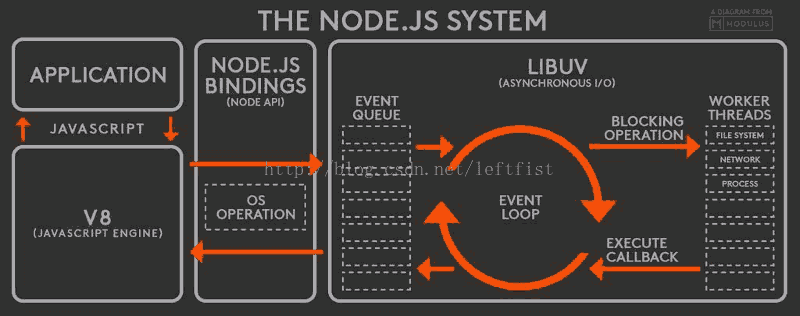

### nodejs

---

**nodejs相关事件：**

+ 2016年底，Reaktor Hello World 卫星将搭载 nodejs 环境来运行一些程序监控和优化卫星的传感器


**为什么需要学和用到 node ？**

+ 为性能指标负责，做直出
+ 削减后台 api 为自己所用
+ 让 fe 可以自动控制整个项目，做真正的前后端分离


node 微服务属于大前端，部署属于运维，开发属于前端


#### 前端开发分为4个方向：

---

**CSR（客户端渲染） + SPA（单页面应用）**

现在最常见的就是 SPA 开发方式，例如：vue、react等，都是通过打包最后生成一个 dist 包

这样做的缺点就是：调用后端远程 api 都会导致跨域、前端都是假路由，无法做 ssr(服务器渲染)，也就是直出

跨域解决方式：一般的公司团队都会架一个 nginx 来进行反向代理，nginx 会分发出两块：java 服务和 dist 包这样来解决跨域问题


**基于 bff 架构的方式：node + spa**

> BFF(Backends For Frontends 服务于前端的后端)，BFF就是服务器设计API时会考虑到不同设备的需求，也就是为不同的设备提供不同的API接口，虽然它们可能是实现相同的功能，但因为不同设备的特殊性，它们对服务端的API访问也各有其特点，需要区别处理

node + spa 开发方式，spa 还是正常的生成一个 dist 包，为了减少跨域，会有一层 node 服务配合，node 需要将所有的东西转回 dist，然后 node 和 java 来相互通信，node 服务只是帮助渲染 index.html


**SSR（服务端渲染） + MPA（多页面应用）**

这种就是直接使用 node 服务 + 模板引擎（swig），然后直接和 java 服务通信


**同构化**

 同构化是对 SSR + MPA 的升级，同构化就是前后端公用一套模板引擎


### 这节课所讲的内容：

+ Nodejs 异步 IO 原理浅析及优化方案
+ Nodejs 内存管理机制及内存优化
+ 大规模 Node 站点结构原理分析
+ 服务器集群管理与 Node 集群的应用
+ UV 过千万的 Node 站点真身


### Nodejs 异步 IO 原理浅析及优化方案

---

> Nodejs 是异步 IO 是因为：因为 Nodejs 是基于 v8的，v8 是异步的。

**异步 IO 的好处：**

+ 前端通过异步 IO 可以消除 UI 堵塞

+ 假设请求资源 A 的时间为 M，请求资源 B 的时间为 N，那么同步的请求耗时为 M+N，如果采用异步方式占用时间为 Max(M, N)

+ 随着业务的复杂，会引入分布式系统，时间会线性的增加，M+N+... 和 Max(M, N, ...)，这会放大同步和异步之间的差异

+ I/O 是昂贵的，分布式 I/O 是更昂贵的（分布式 I/O 要读取到对应值的时候，这个值并不在当前的机器上，在远程的机器上，所以必须要走网络，读取的时间就变长了）

+ Nodejs 适用于 IO 密集型，不适用 CPU 密集型。

  IO密集型：系统大量的吞吐，比如：游戏打boss大量的掉血，频繁发起请求的时候，就比较适用，因为 Nodejs 是异步的

  CPU密集型：大量的计算，比如：银行的各种计算，Nodejs 是单线程的，虽然可以开多线程，但是没有 java 多线程那么完善，还有 js 的处理机制在底层就不适合做 cpu 密集场景，因为 js 是单线程的

  js 是单线是因为：js 一开始是为了处理dom节点，假如当a线程想删除这个dom，b线程想给这个dom加样式，这个时候就互相冲突了，而且 js 也没有锁的概念，现在刚有原子锁的操作，但是还是不好控制，依旧没有java那么完善


**扩展知识**

|     I/O      | 花费的 CPU 时钟周期 |
| :----------: | :-----------------: |
| CPU 一级缓存 |          3          |
| CPU 二级缓存 |         14          |
|     内存     |         250         |
|     硬盘     |      41000000       |
|     网络     |      240000000      |

1. 什么是 I/O？
   + I 就是 input，也就是输入。O 就是 output，也就是输出。I/O 就是输入输出
2. CUP 时钟周期的算法：
   + 1 / cpu 主频  --> 1s / 3.1 GHz
   + 主频越大，时钟周期就越小
3. 操作系统对计算机进行了抽象，将所有输入输出设备抽象为文件。内核在进行文件 I/O 操作时，通过文件描述符进行管理。应用程序如果需要进行 IO 的话需要打开文件描述符，再进行文件和数据的读写。异步 IO 不带数据直接返回，要获取数据还需要通过文件描述符再次读取


完美的异步 IO 应该是应用程序发起非阻塞调用，无需通过遍历或者时间




常见问题：

1. node 不是单线程吗？那事件循环谁来处理？
   + node 虽然是单线程的，但是 node 里面的事件循环和浏览器里是不一样的，node 事件循环是 LIBUV 管理的


#### 几个特殊的 API：

1. setTimeout 和 setInterval 线程池不参与

   + 这两个 API 能自己进自己出来，比较牛逼

2. process.nextTick() 实现类似 setTimeout(function(){}, 0); 每次调用放入队列中，在下一轮循环中取出

3. setImmediate() 比 process.nextTick() 优先级低

4. Node 如何实现一个 Sleep？

   ``` javascript
   async function test() {
       console.log('Hello');
       await sleep(1000);
       console.log('world');
   }
   function sleep(ms) {
   	return new Promise(resolve => setTimeout(resolve, ms))
   }
   test()
   ```

   

测试：

``` javascript
setTimeout(function() {
    console.log(1);
}, 0);
setImmediate(function() {
    console.log(2);
});
process.nextTick(() => {
    console.log(3);
})
new Promise((resolve, reject) => {
    console.log(4);
    resolve(4);
}).then(function() {
    console.log(5);
})
console.log(6);

// 4 6 3 5 1 2 
```

4：因为 Promise 立刻调用

6：console.log()是同步调用的

3：nextTick 是当前同步队列执行完，立刻执行

5：Promise.then的优先级较高

1：因为 setTimeout 设置延迟为 0 ， 所以执行速度比 setImmediate 快

2：最后执行 setImmediate


#### 函数式编程在 Node 中的应用

1. 高阶函数：可以将函数作为输入或者返回值，形成一种后续传递风格的结果接收方式，而非单一的返回值形式。后续传递风格的程序将函数业务重点从返回值传递到回调函数中
	``` javascript
  app.use(function() {  })
  var emitter = new events.EventEmitter;
  emitter.on(function() {});
  ```
2. 偏函数：指定部分参数产生一个新的定制函数的形式就是偏函数。Node 中异步编程非常常见，我们通过哨兵变量会很容易造成业务的混乱
  


#### 常用的 Node 控制异步技术手段：

1. Step、wind（提供等待的异步库）、Bigpipe、Q.js

2. Async、Await

3. Promise/Defferred 是一种先执行异步调用，延迟传递的处理方式。Promise 是高级接口，事件是低级接口。低级接口可以构建更多复杂的场景，高级接口一旦定义，不太容易变化，不再有低级接口的灵活性，但对于解决问题非常有效

4. 由于 Node 基于 V8 的原因，目前还不支持协程。协程不是进程或线程，其执行过程更类似于子例程，或者说不带返回值的函数调用

   一个程序可以包含多个协程，可以对比与一个进程包含多个线程，因而下面我们来比较协程和线程。我们知道多个线程相对独立，有自己的上下文，切换受系统控制；而协程也相对独立，有自己的上下文，但是其切换由自己控制，由当前协程切换到其他协程由当前协程来控制


**注意：**

+ Promise 不是一个语法，是因为 js 实现了 Promise 的语法，Promise/Defferred 是一种处理方式 


### Nodejs 内存管理机制及内存优化

---

#### V8 垃圾回收机制

+ Node 使用 JavaScript 在服务端操作大内存对象受到了一定的限制（堆区），64位系统下约为1.4GB，栈区32位操作系统下是0.7GB

+ 新生代64位是32M，32位是16M

  node --max-new-space-size app.js;

  -max-old-space-size app.js

+ Process.memoryUsage --> rss、heaptTotal、heapUsed

+ V8的垃圾回收策略主要基于分代式垃圾回收机制。在自动垃圾回收的演变过程中，人们发现没有一种垃圾回收算法能够胜任所有的场景。V8中内存分为新生代和老生代两代。新生代为存活时间较短对象，老生代中为存活时间较长的对像

  一句话表示：小孩子尽管玩，到处丢东西大人收


#### Scavenge 算法

在分代基础上，新生代的对象主要通过 Scavenge 算法进行垃圾回收，在具体实现时主要采用 Cheney 算法。Cheney 算法是一种采用复制的方式实现的垃圾回收算法。它将内存一分为二，每一个控件称为 semispace。这两个 semispace 中一个处于使用，一个处于闲置。处于使用的称之为 From，闲置的称之为 To，分配对象时先分配到 From，当开始进行垃圾回收时，检查 From 存活对象赋值到 To，非存活对象则被释放。然后 Form 和 To 互换位置。再次进行回收，发现被回收过超过5次直接晋升到老生代 ，或者 To 控件已经使用了超过 25% 也晋升到老生代，它的缺点是只能使用堆内存的一半，这是一个典型的空间换时间的办法，但是新生代生命周期较短，恰恰就适合这个算法


#### Mark-Sweep & Mark-compact

V8 老生代主要采用 Mark-Sweep 和 Mark-compact。使用 Scavenge 不合适，一个是对象较多需要赋值量太大，而且还是没能解决空间问题。Mark-Sweep 是标记清除，标记那些死亡的对象，然后清除。但是清除过后出现内存不连续的情况，所以我们要使用 Mark-compact它是基于 Mark-Sweep 演变而来的，他先将活着的对象移到一边，移动完成后，直接清理边界外的内存。当 CPU 空间不足的时候会非常的高效。V8 后续还引入了延迟处理，增量处理，并计划引入并行标记处理

当 CPU 内存不连续占满内存后，就会触发 Mark-compact ，类似于压缩内存的效果


#### 何时启动GC回收

扫描指针：扫描指针按照词法作用域进行广度优先遍历

分配指针：当扫描指针确定该对象有引用时，则将该对象交给分配指针为他分配空间


#### V8 垃圾回收机制


 

#### 常见内存泄漏问题

+ 无限制增长的数组
+ 无限制设置属性和值
+ 任何模块内的私有变量和方法均是永驻内存的（释放的方法：a = null）
+ 大循环，无 GC 机会


#### 内存泄漏分析

``` shell
node-inspector
console.log("Server PID", process.pid);
sudo node --inspect app.js
while true;do curl "http://localhost:1337/";done
top -pid 2322
```


### 大规模 Node 站点结构原理分析

---

#### 经典的 MVC 框架


#### .NET 多层架构


+ BLL：业务层（页面）
+ websiteTest：测试
+ website：网站
+ webControllers：控制层（路由）
+ IDAL、DALFactory、SQLServerDAL
  + iDAL：接口
  + SQLServerDAL：实现接口
  + DALFactory：把 iDAL 和 SQLServerDAL 连接起来，供给 BLL 业务层使用
+ DBUtility：对数据库一些接口的封装
+ Model：和数据库之间的持久层
+ DataCache：数据缓存
+ DLLibrary：类库


#### JavaWeb 多层架构


+ action：动作
+ dao：实现
+ po：持久层（model）
+ service：服务


### Node 集群的应用

---

#### 预备上线

+ 前端工程化的搭载动态文件的 MAP 分析压缩打包合并至 CDN
+ 单侧、压测、性能分析工具发现 bug
+ 编写 nginx-conf 实现负载均衡和反向代理
+ PM2 启动应用程序小流量灰度上线，修复 BUG


#### 多线程

+ Master 进程均为主进程，Fork 可以创造主从进程
+ 通过 child_process 可以和 NET 模块组合，可以创建多个线程并监听统一端口。通过句柄传递完成自动重启、发射自杀信号、限量重启、负载均衡
+ Node 默认的机制是采用操作系统的抢占式策略。闲着的进程争抢了任务，但是会造成 CPU 闲置的 IO 暂时并未闲置。Node 后来引入了 Round-Robin 机制，也叫轮叫调度。主进程接收任务，再发任务
+ 每个子进程做好自己的事，然后通过进程间通信来将他们连接起来。这符合 Unix 的设计理念，每个进程只做一件事，并做好。将复杂分解为简单，将简单组合成强大


#### PM2

pm2 是一个带有负载均衡功能的 Node 应用的进程管理器

当你要把你的独立代码利用全部服务器上的所有 CPU，并保证进程永远都活着，0秒的重载

1. 内建负载均衡（使用 Node cluster 集群模块）
2. 后台运行
3. 0 秒停机重载
4. 具有 Ubuntu 和 CentOS 的启动脚本
5. 停止不稳定的进程（避免无线循环）
6. 控制台检测
7. 提供 HTTP API
8. 远程控制和实时的接口 API（Nodejs 模块，允许和 PM2 进程管理器交互）

测试过 Nodejs v0.11、v0.10、v0.8版本，兼容 CoffeeScript，基于 Linux 和 MacOS


### 服务器集群应用

---

``` 
NGINX/LVS(代理) ——> PM2(node服务) ——> Varnish/Stupid(缓存服务) ——> java(后台服务) ——> DB(数据库服务) ——> WRITE/READ(数据库写读服务) ——> BACK(数据库容灾机制)

PM2(node服务) ——> CDN 静态资源

Nagios 检测服务器使用状态

keepalived/heartbeat 心跳检测
```


### UV 过千万的 Node 站点真身


+ docs：项目开发文档
+ nodeuii：后端文件
+ scripts：项目部署文件
+ webapp：前端文件


+ bin：命令行
+ config：配置
+ controllers：路由
+ lib：公用库
+ middleware：中间件
+ models：models
+ nginx-conf：nginx 配置
+ public：资源（上线的时候用shell脚本把资源丢到远程cdn）
+ receiver-master：接收 webapp 编译过来的资源
+ test：测试
+ views：模板


#### 经典代码

``` javascript
router.get(/^\/(\d+)_(\d+)/, cModel.A, cModel.B, cModel.C);

var shaObj = new jsSHA(string, 'TEXT');
var hash = shaObj.getHash('SHA-1', 'HEx');

var forPound = req.headers['x-forwarded-for-pound'];

callback(new Error('Fail to parse http response to json, '), res.body);	// 捕获错误的方式来写代码，用捕错来处理业务逻辑，这是一种编程范式(例：babel)

require('./middleware')(app);	// 没有必要具体到文件
```

