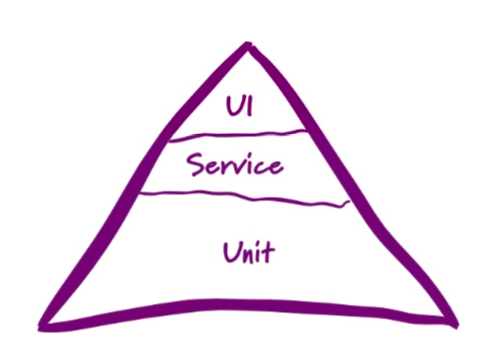

1.大家在开发Node.js的时候都知道异步的嵌套非常麻烦，有人叫回调地域有人叫回调黑洞，请问如何解决这个问题?(5分)

使用promise + async来解决回调黑洞的问题

``` javascript
function sleep(s) {
    return new Promise((resolve, reject) => {
        setTimeout(() => {
            console.log(s)
        	resolve(s);
    	}, s)
    })
}

(async () => {
   	const oneSec = await sleep(1000);
    const twoSec = await sleep(2000);
})();
```


2.如何解释NodeJS 适用于IO密集型不适用CPU密集型?(5分)

IO密集型：指的是系统的CPU性能相对硬盘、内存要好很多，系统运作时，大部分的状况是CPU在等I/O（硬盘/内存）的读/写操作

CPU密集型：CPU密集型指的是计算机大量的计算，此时cpu占用率非常高

Nodejs适合IO密集型的原因是：node可以做异步IO处理

不适合CPU密集型的原因是：nodejs本身是单线程的，虽然现在也可以开多线程，但是没有java的多线程那么完善，还有js的处理机制在底层就不适合做cpu密集场景，因为js是单线程的


3.请画出Node.js的异步事件回调机制的实现,并解释原理。(5分)


4.开完一个完整的Node程序，有UI层、Service层、DAO层、MODEL层等，我们要在交给QA前需要编写测试用例。测试用例一般遵循测试金字塔(测试金字塔指的是在编写测试用例时，底层的单元测试应该远比上层的端到端测试要多，如下图)请问在如下三个阶段，都用什么样的技术进行测试用例的编写。(10分)




5.有人说Node是玩具，写错一处整个网站就挂。为了解决它你有什么办法么?(10分)

答：在项目里面添加容错机制，并且引入日志包，帮助我们打印日志，好查询bug所在

利用pm2来开启node多线程


6-1.请你写出HTTP协议三次握手，四次挥手过程，并写出常见的HTTP Status Code标明他的含义、你知道的HTTP请求报头以及HTTP2的优点(5分) 


6-2.你知道什么是OSI七层模型和TCP/IP五层模型么，请详细描述。 


7.看你简历中有说使用NodeJS完成BFF的架构搭建，你能说明下为什么你们团队使用 Node么以及具体的技术栈。(20分) 


8.NodeJS使用了Scavenge、Mark-Sweep 、 Mark-compact算法进行垃圾回收，请绘制三种算法的原理，并描述何种情况下会造成NodeJS的内存泄露，如何检测?(20分)


9.请你写出你能力范围的一个Node项目文件夹的划分，并标明他的作用。(10分)


10.Nginx的反向代理是什么?怎么配置。PM2是什么?怎么配置。(10分)


