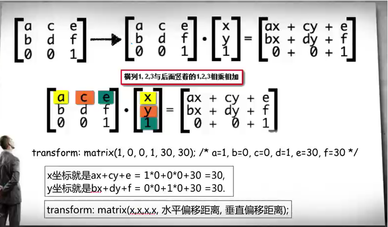
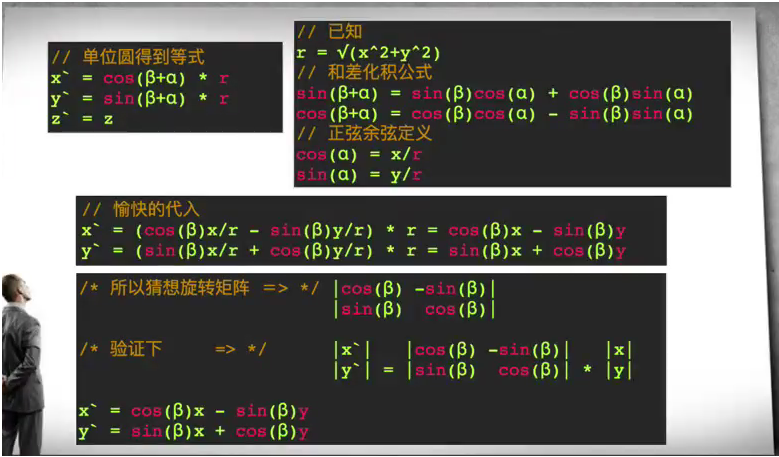

### ICON-FONT与常用字体排版

**ICON-FONT出现的原因：**

+ 前端越来越少使用雪碧图来维护前端的样式（因为请求会把这图片变大、合并出来的雪碧图依旧无法满足日益变化的屏幕分辨率）
+ ICON-FONT可以减少请求，可以不失真，不需要加载额外的图片


**规格要求：**
+ no-image时代，使用不超过纯色为2的图像（当需要使用超过纯色为2的ICON-FONT的时候，可以使用阿里的Symbol字体，参考地址[阿里巴巴矢量图标库](https://www.iconfont.cn)）（但是更推荐的是cssIcon，完全css写的，也不存在失真，更极致的性能优化）
+ 宋体非宋体，黑体非黑体，windows下的宋体叫做中易宋体SimSun，Mac是华文宋体STSong。windows下的黑体叫中易黑体SimHei，Mac是华文黑体STHeiti
+ 不要只写中文字体名，保证西文字体在中文字体前面。Mac -> Linux -> Windows
+ 切忌不要直接使用设计师PSD的设计font-family，关键时刻再去启动font-face（typo.css、Entry.css、Type.css）
+ font-family: sans-serif; 系统默认，字体多个单词组成引号


### css绘制图形

注意：
+ dom是非常昂贵的
+ 多使用伪类
+ 善用阴影、简便

css效果

```css
.animate {
    transform: rotate(1turn) translateX(90px);
}

.animate {
    transform: translateX(90px) rotate(1turn);
}
```


### 矩阵

**transform原理**
> skew、scale、rotate、translate原理都是通过改变矩阵对应的值来实现的

**算法**





