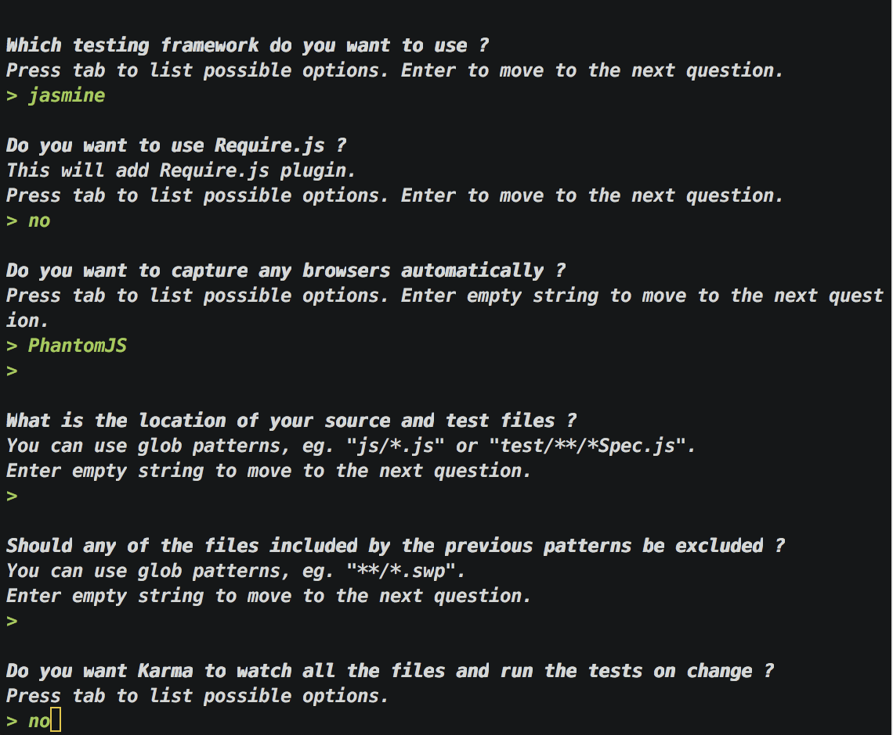
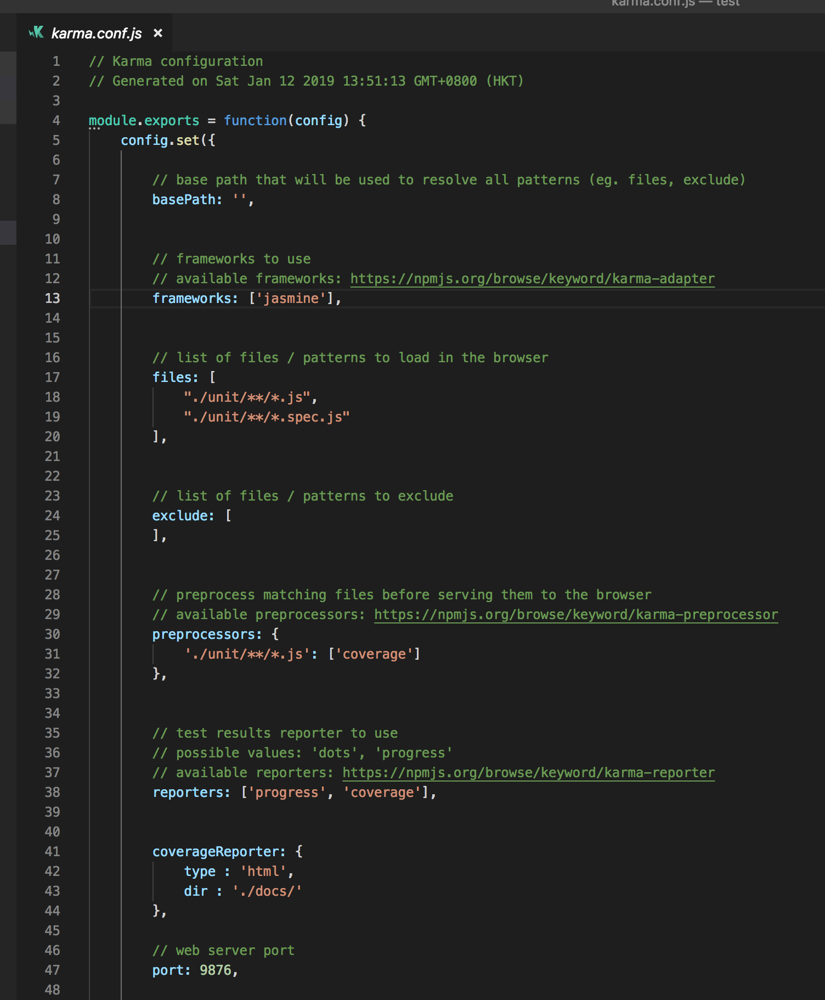
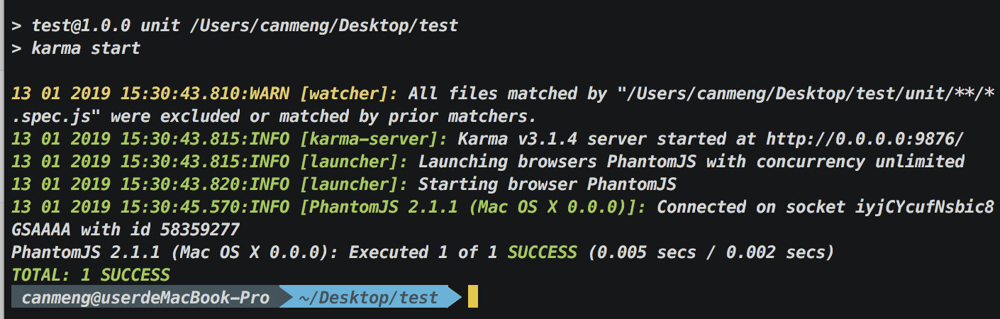
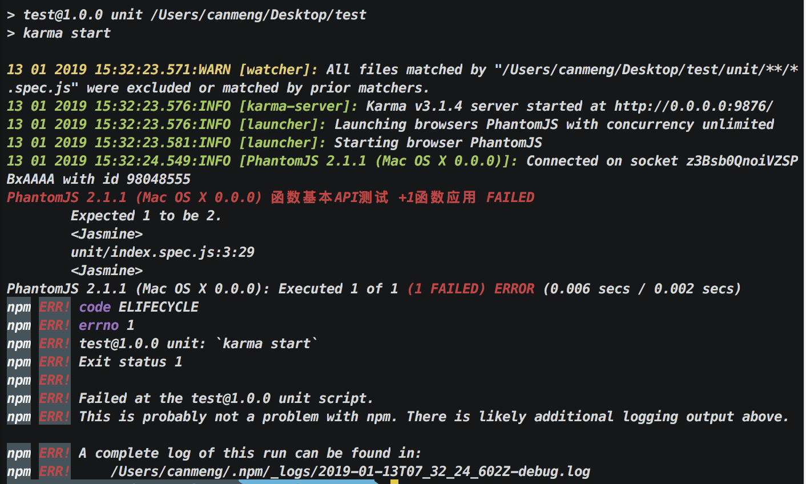
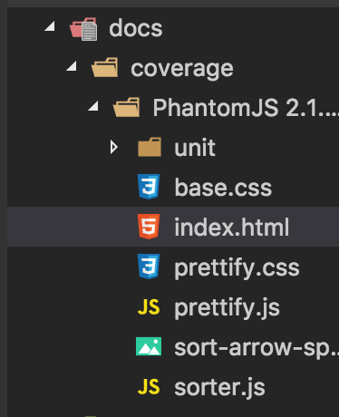
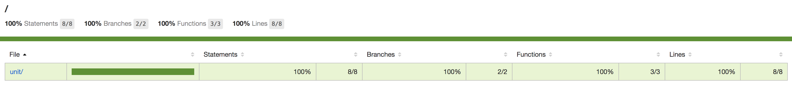

## 使用karma和jasmine配合phantom浏览器进行单元测试

###初始化package.json

实现初始化 NPM 包管理，创建`package.json`项目管理文件。

使用参数`-y`直接按照默认值创建`packgae.json`项目管理文件。

> npm init -y

```json


{
  "name": "test",
  "version": "1.0.0",
  "description": "",
  "main": "index.js",
  "scripts": {
    "test": "echo \"Error: no test specified\" && exit 1"
  },
  "keywords": [],
  "author": "",
  "license": "ISC"
}

```


### 安装karma

我们需要集成`karma`，参考[karma官网](http://karma-runner.github.io/3.0/index.html)

使用cnpm下载包（注：npm下载没比较好的科学上网是很难下载的，所以我们选择cnpm）

```bash
npm install karma --save-dev
npm install karma-jasmine jasmine-core --save-dev
```

上面三个包分别是：

+ karma（karma测试驱动）
+ karma-jasmine（karma适用于Jasmine测试框架的适配器）
+ jasmine-core（jasmine测试框架）


### 初始化karma

由于我们安装的包是局部安装的，所以将`package.json`内的`scripts`属性`设置为：

```bash
"scripts": {
    "karma_init": "karma init"
}
```

然后运行`npm run karma_init`来初始化`karma`，然后配置如下：



问题分别是：

+ 你想使用哪个测试框架？
+ 您想使用Require.js吗?
+ 您想要使用哪个浏览器测试？
+ 源文件和测试文件的位置是什么？
+ 是否应该排除前面模式中包含的任何文件？
+ 您希望karma监视所有文件并在更改上运行测试吗？


选择完成之后会生成一个`karma.conf.js`文件




因为我们使用的是无头浏览器`phantom`，所以我们需要将`karma.conf.js`中的`singleRun`属性设为`true`


### 安装Phantom无头浏览器

集成完`karma`之后，我们还需要安装进行测试的浏览器`phantom`

```bash
cnpm i phantom -D
```


### 安装karma启动phantom浏览器的启动包

需要让`karma`能够启动`phantom`浏览器还需要一个启动包

```bash
cnpm install --save-dev karma-phantomjs-launcher
```


### 开始测试

先来一段小的测试demo，新建一个`unit`文件夹，里面新建一个`index.js`和`index.spec.js`（带有`.spec`的js都是用来测试用的）

> `index.js`里面写入：

```javascript
window.add = function(a) {
	if (a == 1) {
		return a;
	} else {
		return a + 1;
	}
}	
```

> `index.spec.js`里面写入：

```javascript
describe("函数基本API测试", function() {
	it("+1函数应用", function() {
		expect(window.add(1)).toBe(1);
		expect(window.add(2)).toBe(3);
	})
})
```


指定karma的测试地址

> 将`karma.conf.js`中的`files`配置为：

```javascript
files: [
    "./unit/**/*.js",
    "./unit/**/*.spec.js"
]
```


> 将`package.json`内的`scripts`配置为：

```bash
"scripts": {
    "karma_init": "karma init",
    "karma_unit": "karma start"
}
```


运行`npm run karma_unit`进行测试

> 测试成功的话为：




> 测试失败的话为：




### 安装生成测试报告的包

直接在命令窗口查看的测试结果并不直观，所以我们需要一个生成测试报告的包，以便我们查看测试的结果

```bash
cnpm install karma-coverage --save-dev
```


然后我们更改`karma.conf.js`中的配置

> 在reporters数组中新增`coverage`

```javascript
reporters: ['progress', 'coverage']
```

> 将`preprocessors`属性设置为：

```javascript
'./unit/**/*.js': ['coverage']	// 测试文件地址
```

> 新增一个`coverageReporter`属性：

```javascript
coverageReporter: {
    type : 'html',
    dir : './docs/coverage/'	// 测试报告生成地址
}
```


这时我们再运行`npm run karma_unit ` ，在`docs/coverage`下就会生成一个html文件，这个html文件就是整个测试的报告了






到这里，就算大功告成了！